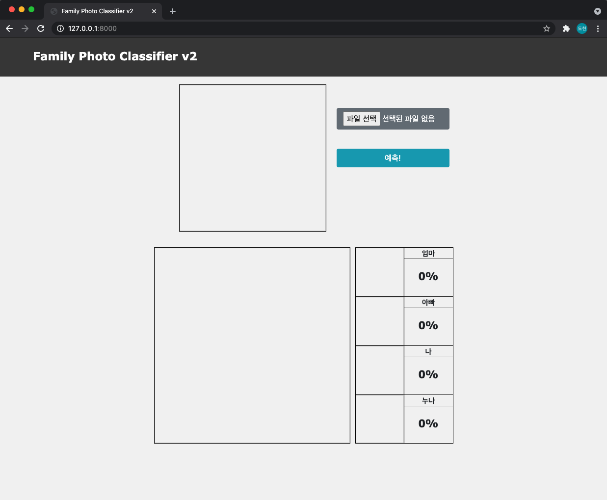
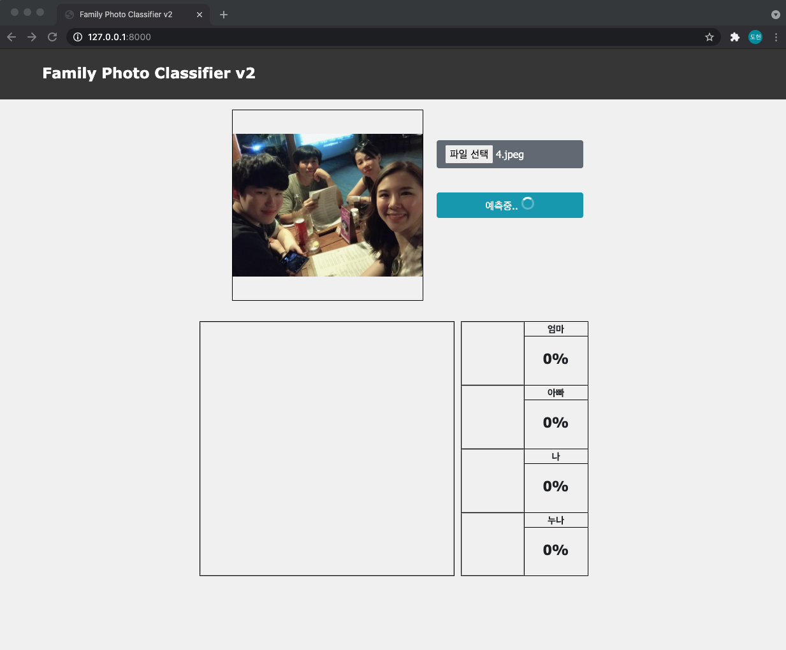
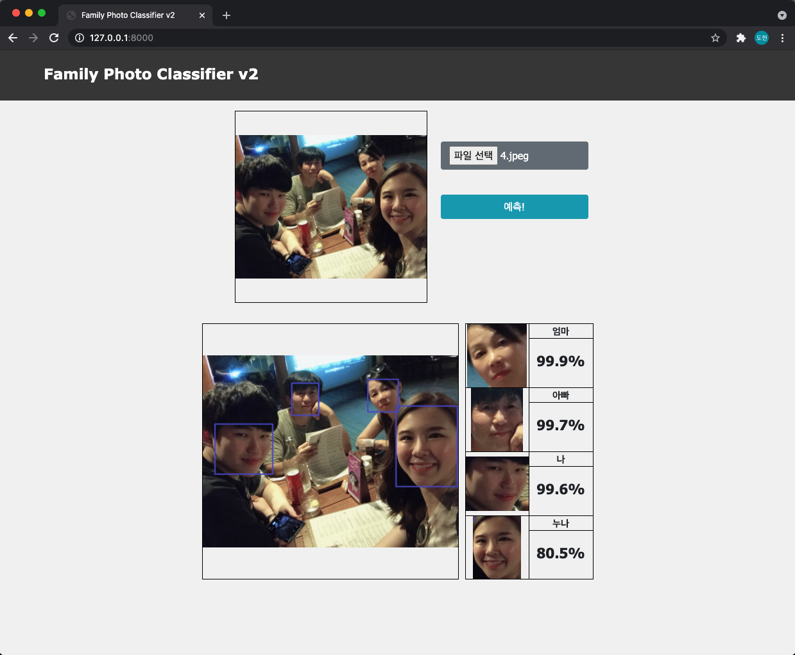
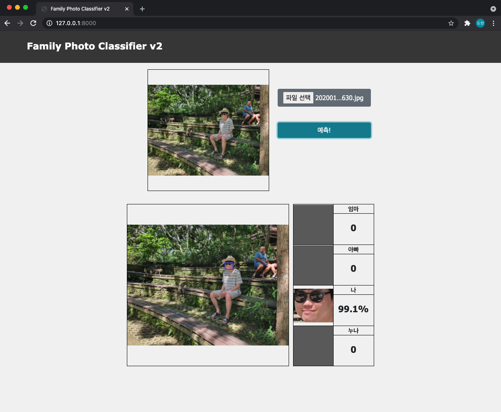

# Family Photo Classifier V2

[detectron2](https://github.com/facebookresearch/detectron2), pytorch, django를 이용하여 제작한 가족사진 분류 web applicaiton.  

사진을 첨부하면 사진에서 우리 가족의 얼굴을 추출해서 누가 이 사진에 있는지 알려준다.  

Object Detection을 이용하여 이전 버전보다 성능이 대폭 상승하였다.  

[Family Photo Classifier V1 (이전 버전)](https://github.com/Doheon/familyphotoproj)

**다음과 같은 순서로 과정이 진행된다.**  

1. 사진에 존재하는 모든 얼굴 탐색
2. 각 얼굴에 multi-label classification 적용
3. 4명의 class 별로 가장 확률이 높은 사진을 하나씩 추출
4. 해당 얼굴의 정확도가 기준치보다 높다면 있음, 낮다면 없다고 판단
5. 있다고 판단된 얼굴만 추출하고 결과를 보여줌

## 화면

|  |  |
| :-----------------------: | :-----------------------: |
|      시작 인터페이스      |     사진 첨부시 화면      |

|  |
| :-----------------------: |
|    가족사진 예측 화면     |

위의 사진을 보면 가족 4명을 모두 잘 예측한 것을 확인할 수 있다.  

|       |
| :----------------------------: |
| 독사진 예측 화면 (외부인 포함) |

위의 결과를 보면 독사진도 잘 분류하고, 외부인은 잘 제외한 것을 확인할 수 있다.  

### 동기  

가족여행을 다녀오고 사진을 종합해 보니 2000여장이 넘는 사진이 나왔다.  

사진은 많은데 아무도 분류를 안해서 저장소에 방치되고 있었다.  

사진을 우리 가족의 구성원중 누군지 알려주고 자동으로 분류해주는 우리 가족 전용 분류기를 만들기 위해 이 프로젝트를 진행하였다.  

&nbsp;

# Modeling

이 프로젝트에는 두 개의 deep learning model이 사용된다. 

1. [Detectron2](https://github.com/facebookresearch/detectron2) 를 이용하여 제작한 Face Detector
2. 검출된 얼굴을 분류하는 multi-label classifer

모든 모델의 학습과정은 colab을 이용하였으며 그 과정은 아래 링크와 같다.  

[모델학습 colab code](https://colab.research.google.com/drive/1D0dI3jyUD1izPLNpetX6vJn2eHUotqY5?usp=sharing)  

처음에는 face detector가 아니라 person detector로 진행하였으나 효과가 좋지 않아서 face detector로 다시 진행하였다.  

### Face Detector

[Detectron2](https://github.com/facebookresearch/detectron2)를 이용하여 face Detector를 제작하였다.  그 과정은 아래와 같다.  

1. [OIDv4 toolkit](https://github.com/EscVM/OIDv4_ToolKit)을 이용하여 1000개의 얼굴 데이터셋 생성
2. [roboflow](https://roboflow.com/)를 이용하여 label을 coco format으로 변환
3. detectron2의 faster_rcnn을 이용하여 face의 클래스만 가지는 object detector 학습

### Multi-Label Classifer  

추출된 얼굴을 input으로 받으면 그 얼굴이 누구인지 각 label별 확률을 계산하는 multi-label classifier를 제작하였다.  

**Dataset 생성**  

추출된 얼굴을 input으로 받기 때문에 labeling된 잘린 얼굴이 필요했다. 하지만 얼굴만 추출된 사진은 없었기 때문에 위에서 제작한 face detector를 이용하여 dataset을 제작하였다.  그 과정은 아래와 같다.

1. 모든 사진 중 각 사람별 독사진만 추출한다.
2. 독사진중 얼굴이 비율이 높은 사진을 다시 추출한다.
3. 독사진을 사람별로 나누고 각 사람별 face detector로 얼굴을 추출한다. 얼굴이 여러개가 추출될 경우 면적이 가장 큰 얼굴을 선택한다.
4. 사람 별로 추출했으므로 얼굴은 해당하는 사람으로 분류되어 있다.
5. 최종 사진에서 잘못 추출되었거나, 훈련에 도움이 안될 것 같은 사진은 제외한다.
6. 각 분류의 사진의 개수를  비슷하게 맞춰준다.

**Training**  

위에서 생성한 데이터셋을 가지고 pytorch를 이용하여  multi-label classifier를 훈련시켰다. 

- torchvision의 resnet18을 사용하였다. 
- 30x30사이즈로 resize하고 10개를 1개의 batch로 설정했다.
- 마지막 fc layer의 output의 개수를 4개로 설정하여 4개의 class에 대해 훈련을 진행할 수 있도록 했다.
- loss function은 BCEWithLogitsLoss를 이용하여 multi-label classification을 해결하도록 했다.
- optimizer는 SGD, learning rate는 0.001을 이용했다.
- loss가 적절히 수렴할때 까지 epoch를 조절하면서 훈련을 진행하였다.

&nbsp;

# Predict

위에서 제작한 두 모델을 이용하여 사진이 input으로 들어오면 예측을 진행한다. 그 과정은 아래와 같다.

1. Detectron2를 이용하여 제작한 모델로 사진에 존재하는 모든 얼굴을 추출한다.
2. 추출된 얼굴에 제작한 multi-label classifier를 이용하여 각 클래스별 확률을 계산하여 array에 저장한다.
3. 4개의 클래스별 가장 확률이 높은 얼굴사진을 하나씩 추출한다.
4. 해당 얼굴의 정확도가 기준치보다 높다면 선택하고, 낮다면 해당하는 사람이 존재하지 않는다고 판단한다.
5. 있다고 판단된 얼굴만 추출하고 결과를 template에 전달한다.

가족중 같은 사람이 두 명이 있을수는 없기 때문에 클래스별 가장 큰 값만 선택하는 방법으로 결과를 추출하였다.

&nbsp;

# Result

훈련할때 사용한 데이터와 아닌 데이터에 대해 모두 결과를 확인해본 결과 전체적으로 매우 높은 정확도를 가지고 있는 것을 확인했다.  

앞의 동작화면에서 볼수있다시피 가족전체가 있는 사진이나 독사진에서 모두 좋은 성능을 보였고, 외부인이 섞여있더라도 우리가족이 아니라고 잘 판별한 것을 확인할 수 있었다.

실제로 사진을 분류하는 데에 사용해도 손색이 없을 정도로 좋은 성능을 가지고 있는 것을 확인 했고 우리 가족 전용의 사진 분류기를 제작할 수 있었다.

지금 있는 가족사진은 이미 손으로 다 분류해버려서 이 어플리케이션을 직접 사용하려면 가족여행을 다시 가야 하는데 코로나 때문에 언제 사용할 수 있을 지는 모르겠다. 

